# Project

Reference Paper: [Paper](http://citeseerx.ist.psu.edu/viewdoc/download?doi=10.1.1.447.8010&rep=rep1&type=pdf)

## **MATLAB Toolkits Required**

Image Processing tool box

Signal Processing tool box

## **How to run the code**

- So we have two main codes 'canny.m' and 'main.m' which are present in the folder
'Codes'. In order to observe output of watershed algorithm, run the 'main.m' code
and for running canny based algorithm execute 'canny.m'. 

- Make sure that the image (dataset) path is properly given in the imread command.
- For running the GUI go to the folder named 'GUI' and execute the given file. 

## **Dataset**

The input images used to test the code: [INPUT_IMAGES](https://iiitaphyd-my.sharepoint.com/:u:/g/personal/rishav_goenka_research_iiit_ac_in/EU2xTYm2x3tJkz3p5TPALEkB_pc26wrMgEVmecb1MQ1Xmg?e=QZVQLS)

The output images of the code: [OUTPUT_IMAGES](https://iiitaphyd-my.sharepoint.com/:u:/g/personal/rishav_goenka_research_iiit_ac_in/EXq_kMU5CwFAhbaKPfguExsBlqgPJPzUfP00FvrWOeulLQ?e=h9uq51)

## **Outputs**

### **Original Image:**

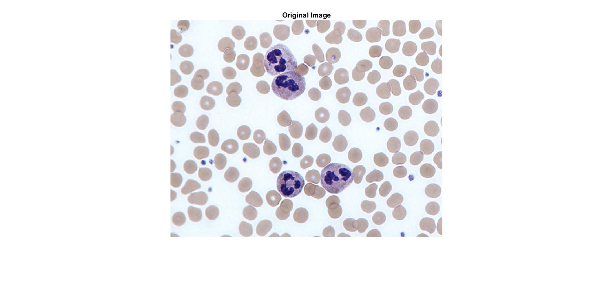

### **Pre-Processed Image:**

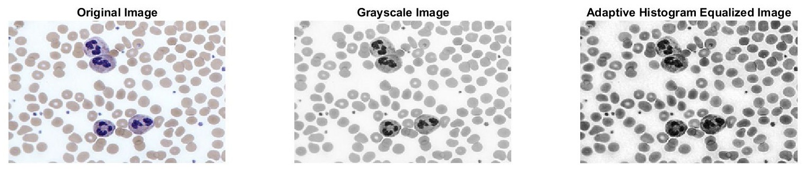

### **Enhanced Image:**

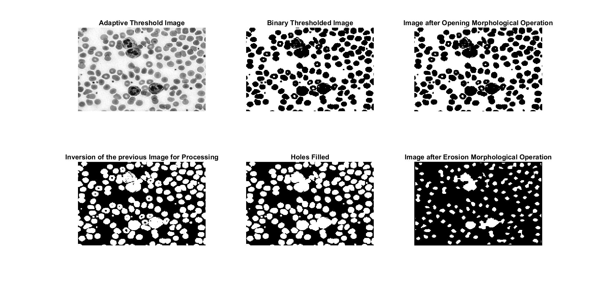

### **Segmented Image:**

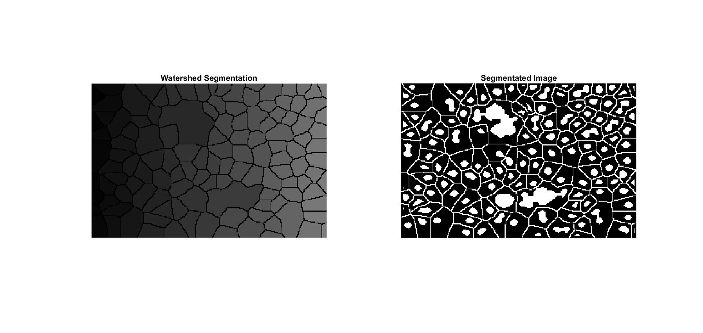

### **Post-Processed Image:**

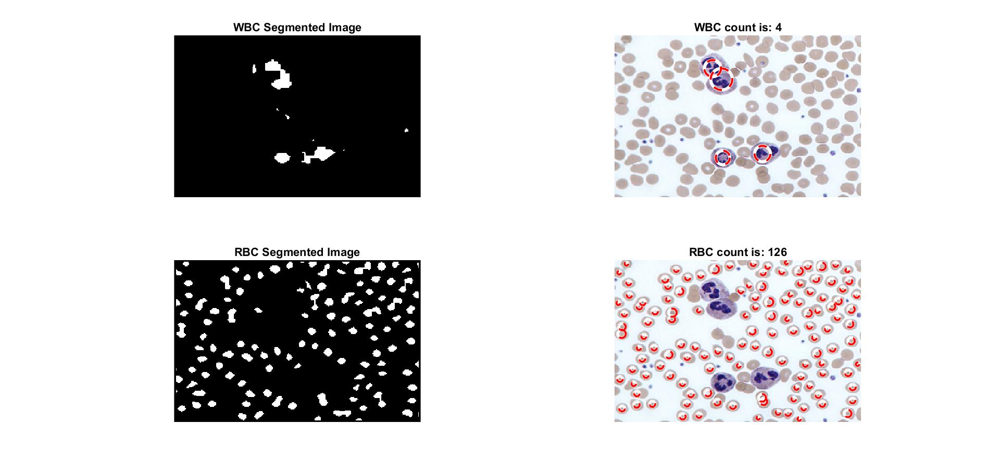

## **GUI**

### **Starting page:** 

On the starting page we will see the instructions in order to run the GUI.

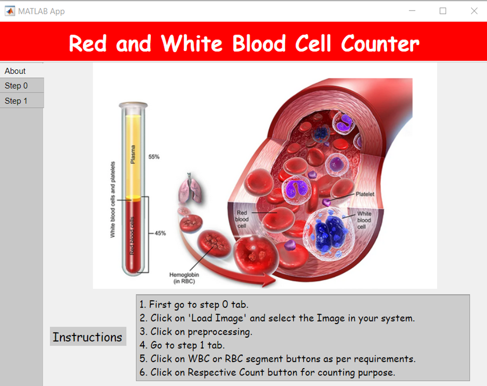

### First Tab:- 

In this tab we will get an option to load the image and perform preprocessing techniques.

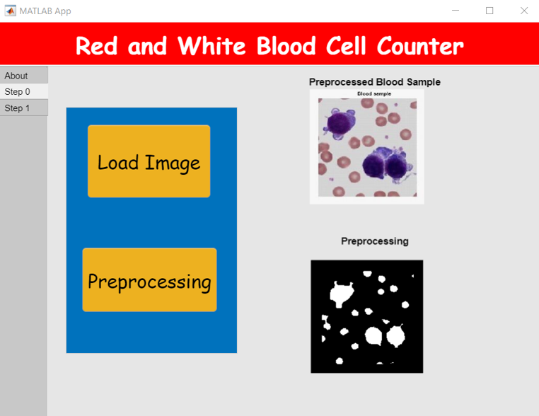 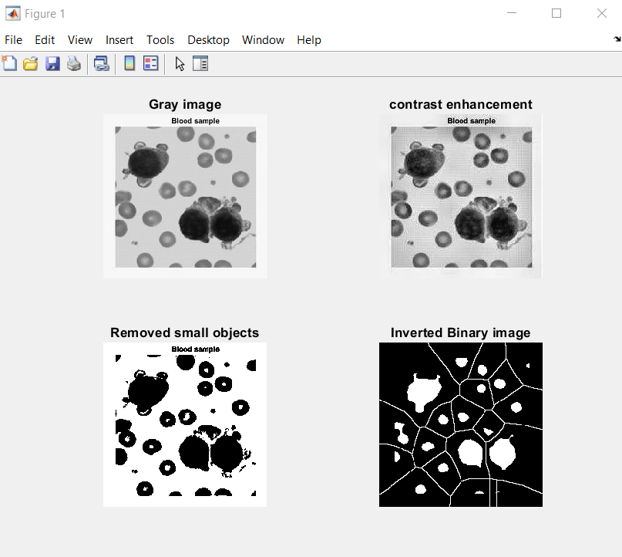

### Second Tab:- 

In this tab we will get the option to segment the respective cells and count them.

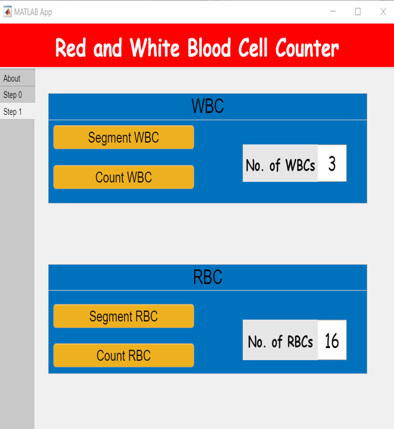 

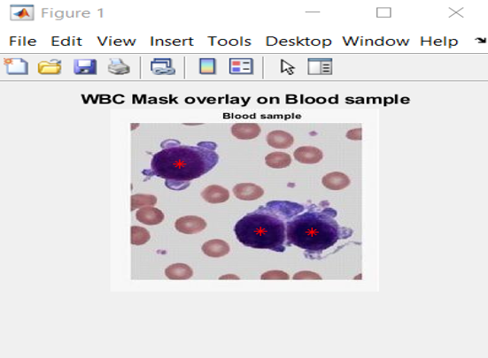 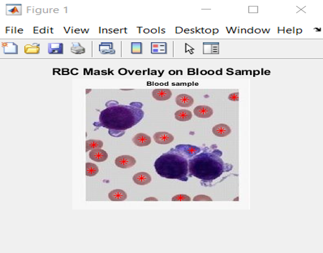 
